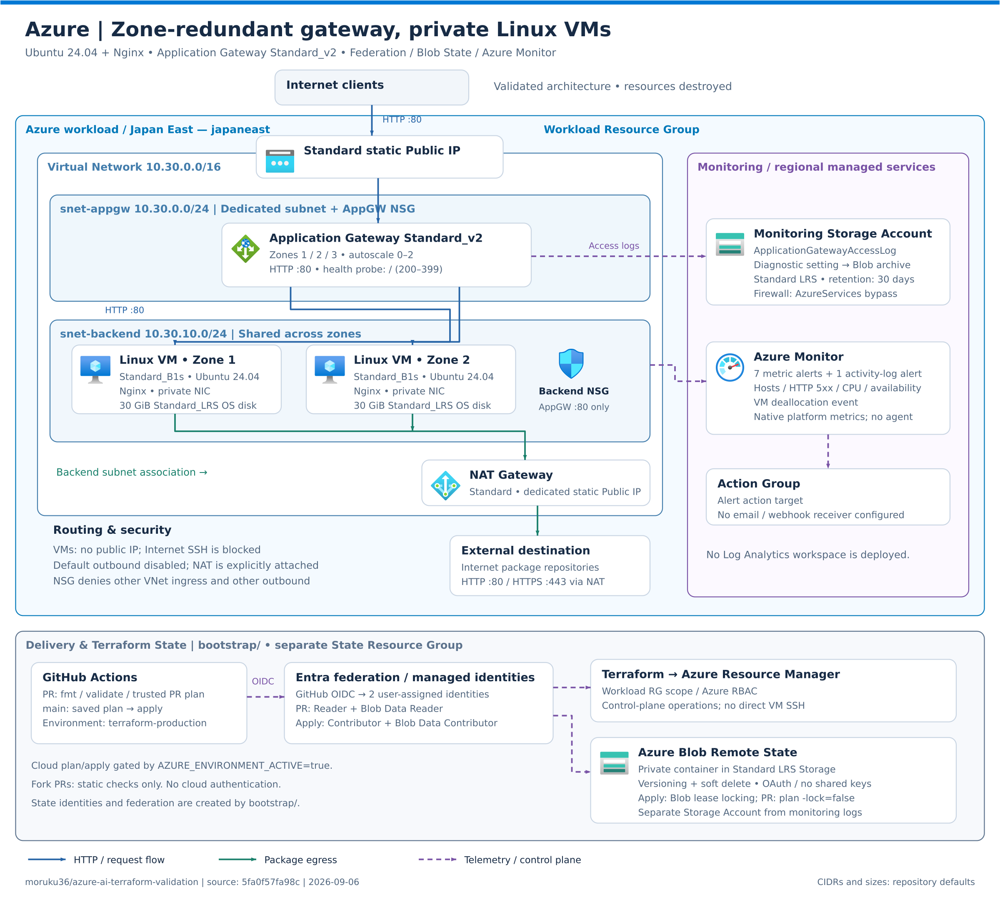

# Azureアーキテクチャ

## 構成図

> GitHubのPC版・モバイル版で同じ構成図を確認できるよう、リポジトリ内のPNGを表示しています。

## Azure固有の判断

- HTTP 5xxメトリクス、アクセスログ、HTTP Health Probeを満たすためApplication Gateway Standard_v2を採用する。
- Application GatewayはAzure仕様に従い専用Subnetへ配置する。
- 2026年以降のPrivate Subnetでは暗黙outboundへ依存せず、NAT Gatewayを明示する。
- Backend NSGのAzure既定VNet許可を明示的に上書きし、Application Gateway SubnetからTCP 80だけを許可する。
- WAF、Azure Firewall、Bastionは今回の要件外かつ高コストなため追加しない。
